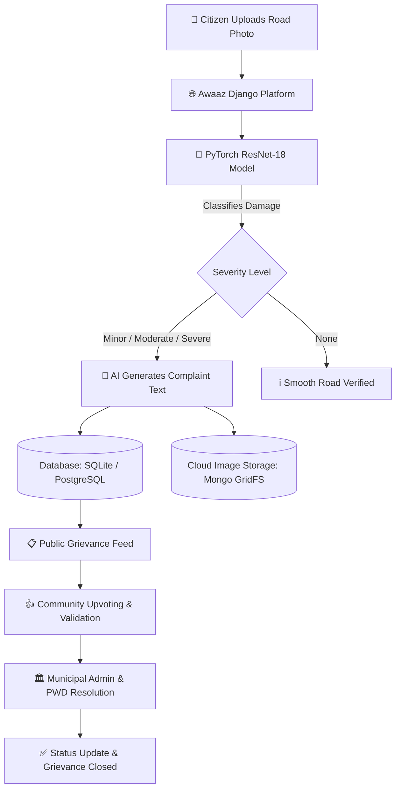

# 🕳️ Awaaz (आवाज़) — AI-Powered Civic SaaS & Pothole Grievance Platform

> **Empowering Citizens, Enabling Governance.**  
> A SaaS-driven civic management platform that connects citizens directly with government authorities and municipal public works departments (PWD) to detect, report, track, and resolve road infrastructure hazards seamlessly.

---

## 📌 Executive Summary

**Awaaz** ("Voice of Citizens") is a SaaS-based Civic Tech platform built to revolutionize municipal grievance redressal for road maintenance. Bad roads and unmonitored potholes lead to vehicle damage, traffic congestion, and fatal accidents. 

Awaaz bridges the gap between citizens and civil administration by providing:
1. **Easy Grievance Reporting for Citizens**: AI-assisted photo upload with automated damage severity assessment and complaint drafting.
2. **Data-Driven Governance for Municipalities**: Real-time civic feed, crowdsourced validation via community upvotes, and structured severity metrics to prioritize road repairs efficiently.

---

## ✨ Key Features

### 🤖 AI-Powered Pothole Detection & Classification
- **Automated Computer Vision Engine**: Powered by a custom **ResNet-18** deep learning model trained to classify road damage into four categories: `None`, `Minor`, `Moderate`, and `Severe`.
- **Confidence Scoring**: Assigns a confidence metric to every analysis and applies adaptive thresholds to eliminate false positives.
- **Hardware Optimized**: Supports hardware-accelerated inference across Apple Silicon (`MPS`), NVIDIA GPUs (`CUDA`), and standard `CPU` environments.

### 📝 Automated AI Complaint Generation
- Eliminates manual documentation friction for citizens by automatically synthesizing clear, formal municipal grievance text tailored to the predicted damage level and severity context.

### 🗳️ Citizen Empowerment & Community Crowdsourcing
- **Public Grievance Feed**: A centralized portal displaying active road issues with search filters (by severity, title, or keyword) and sorting (newest vs. top upvoted).
- **Upvotes & Community Priority**: Citizens upvote severe potholes in their area, giving public works officials a prioritized map of urgent repairs.
- **Discussion & Comments**: Transparent comment threads on each complaint for status updates and community dialogue.
- **Identity & Aadhaar OTP Schema**: Prepared data schema for verified citizen reporting via OTP-based authentication to prevent spam submissions.

### 🎯 Human-in-the-Loop Model Correction
- Citizens and field inspectors can submit **True Severity Corrections** (`true_severity`) directly on complaint records, generating ground-truth data for continuous active learning and retraining.

### 🗄️ Hybrid Multi-Database Architecture
- **Relational Storage**: SQLite / PostgreSQL managed via Django ORM for users, complaints, comments, upvotes, and verification logs.
- **MongoDB GridFS Integration**: Optional high-scalability MongoDB GridFS backend (`MONGO_URI`) for distributed cloud binary storage of high-resolution road evidence images.

---

## 🏗️ System Architecture & Workflow



---

## 🛠️ Technology Stack

| Domain | Technology / Framework |
| :--- | :--- |
| **Backend Framework** | Python 3.10+, Django 5.0 |
| **Machine Learning & CV** | PyTorch, Torchvision, OpenCV, PIL, Scikit-learn, NumPy |
| **Frontend & UI** | HTML5, Tailwind CSS, Dark Theme Components, Streamlit |
| **Database & Storage** | SQLite (Default), MongoDB GridFS (Optional Cloud Blobs), Django ORM |
| **Developer Utilities** | Rich CLI, PyYAML, Git |

---

## 📁 Project Structure

```text
Awaaz/
├── awaaz_web/               # Django Core Project (settings, URLs, WSGI/ASGI)
├── complaints/              # Django App: Grievance Models, Views, Forms & Services
│   ├── models.py            # Complaint, Comment, and AadhaarOTP DB Schemas
│   ├── services.py          # PyTorch Model Loader & AI Complaint Text Synthesizer
│   ├── views.py             # Feed, Upload, Upvote, Comment, and Correction Views
│   ├── views_auth.py        # Authentication & User Management
│   └── urls.py              # Application Routing Configuration
├── src/                     # Machine Learning Core Pipeline
│   ├── app/                 # Inference APIs, Evaluation & Streamlit Playground
│   │   ├── app.py           # Streamlit Interactive Classifier Portal
│   │   ├── predict.py       # Standalone CLI Predictor Script
│   │   └── evaluate.py      # Model Metric Evaluation Tool
│   ├── data/                # Custom PyTorch Dataset & Preprocessing Pipelines
│   ├── models/              # ResNet-18 Classifier Model Architecture
│   ├── train/               # PyTorch Training & Fine-Tuning Scripts
│   └── utils/               # Auto-labeling & Dataset Export Scripts
├── templates/               # Responsive HTML5 Templates with Tailwind CSS
│   ├── complaints/          # feed.html, detail.html, upload.html
│   └── registration/        # login.html, signup.html
├── static/                  # Custom CSS stylesheets and static assets
├── scripts/                 # Utility execution scripts
├── checkpoints/             # Trained PyTorch Model Weight Checkpoints (.pt)
├── manage.py                # Django CLI Controller
└── db.sqlite3               # Local Relational Database
```

---

## 🚀 Getting Started

### 1. Prerequisites
- **Python 3.10** or higher
- `pip` package manager
- Recommended: Virtual environment (`venv`)

### 2. Installation & Environment Setup

```bash
# Clone the repository
git clone https://github.com/Soham167-prog/Awaaz.git
cd Awaaz

# Create and activate virtual environment
python3 -m venv .venv
source .venv/bin/activate  # On Windows: .venv\Scripts\activate

# Install dependencies
pip install --upgrade pip
pip install torch torchvision torchaudio --index-url https://download.pytorch.org/whl/cpu
pip install django streamlit opencv-python pillow numpy scikit-learn rich pyyaml pymongo
```

### 3. Database Migration & Setup

```bash
# Apply Django migrations
python manage.py makemigrations
python manage.py migrate

# Create a superuser / municipal admin account (Optional)
python manage.py createsuperuser
```

---

## 🖥️ Running the Applications

### 🌐 Option 1: Full-Stack Web Platform (Django)

Run the main civic portal for citizen grievance submissions and municipal monitoring:

```bash
python manage.py runserver
```
Navigate to `http://127.0.0.1:8000/` in your browser.

- **`/`**: Public Grievance Feed with search, filters, and upvotes.
- **`/new/`**: Submit a new road photo for AI severity classification and complaint generation.
- **`/login/` & `/signup/`**: Citizen authentication portal.

### 🎨 Option 2: Interactive ML Sandbox (Streamlit)

For quick computer vision experimentation, testing model checkpoints, or inspecting confidence logits:

```bash
streamlit run src/app/app.py
```
Open `http://localhost:8501` to test single image predictions interactively.

### 💻 Option 3: Command-Line Inference

Quickly analyze a road image from the terminal:

```bash
python scripts/predict.py --image path/to/road_image.jpg
```

---

## 🏋️ Machine Learning Model Training

To retrain or fine-tune the Pothole Severity Classifier model on custom datasets:

1. Organize your image dataset in `data/potholes/`:
   ```text
   data/potholes/
   ├── train/
   │   ├── minor/
   │   ├── moderate/
   │   └── severe/
   └── val/
   ```

2. Execute the training script:
   ```bash
   python src/train/train_new.py --data_dir data/potholes --epochs 20 --batch_size 32
   ```

3. Saved checkpoints will be stored under `checkpoints/best.pt`.

---

## 🔮 Strategic Roadmap & SaaS Evolution

- 🗺️ **GIS & Geo-Location Heatmaps**: Interactive map view visualizing pothole density clusters to assist city planners.
- 🏢 **Municipal Admin & PWD Contractor Portal**: Role-based access control (RBAC) allowing government officials to assign repair tickets to field contractors with SLA deadline tracking.
- 📲 **Real-time Push Notifications & WhatsApp Updates**: Automated SMS/WhatsApp updates notifying citizens when their reported grievance changes state from `Submitted` ➔ `In Progress` ➔ `Resolved`.
- 📊 **Government Analytics Dashboard**: Predictive road maintenance insights and civic repair performance analytics for municipal leaders.

---

## 🤝 Contributing

Contributions are welcome! If you'd like to improve the AI model, enhance the frontend UI, or expand backend SaaS features:
1. Fork the Repository.
2. Create a Feature Branch (`git checkout -b feature/AmazingFeature`).
3. Commit your Changes (`git commit -m 'Add some AmazingFeature'`).
4. Push to the Branch (`git push origin feature/AmazingFeature`).
5. Open a Pull Request.

---

## 📄 License

Distributed under the MIT License. See `LICENSE` for more information.
