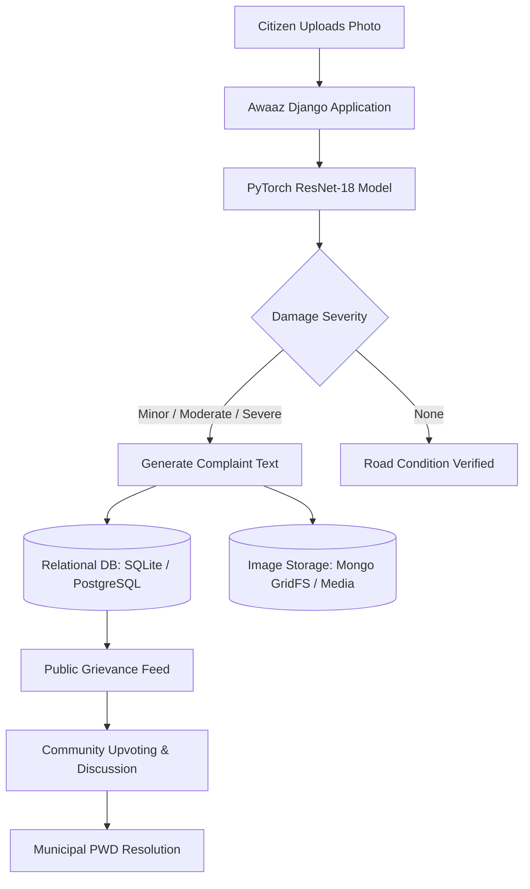

# Awaaz - AI-Powered Civic SaaS & Pothole Grievance Platform

Awaaz is a SaaS-driven civic management platform that connects citizens directly with municipal authorities and public works departments to detect, report, track, and resolve road infrastructure issues.

---

## Overview

Road hazards and unmonitored potholes cause vehicle damage, traffic congestion, and safety risks. Awaaz simplifies grievance redressal by combining computer vision with automated reporting:

1. **Citizen Grievance Submission**: Upload road photos to automatically classify damage severity and generate structured municipal complaints.
2. **Municipal Data & Prioritization**: Public works departments get a real-time civic feed with crowdsourced upvoting, search filters, and severity metrics to prioritize repairs efficiently.

---

## Features

- **Pothole Detection & Classification**: Custom ResNet-18 deep learning model classifying road damage into `None`, `Minor`, `Moderate`, and `Severe`. Supports MPS (Apple Silicon), CUDA, and CPU execution.
- **Automated Complaint Generation**: Synthesizes structured, formal grievance copy based on predicted damage severity and model confidence.
- **Civic Feed & Upvoting**: Filterable grievance list (by severity, title, or keyword) with community upvoting to surface urgent road repairs.
- **Discussion & Comments**: Threaded commentary on complaint records for updates between citizens and administrators.
- **Model Correction System**: Allows users and field inspectors to submit ground-truth corrections (`true_severity`) to fine-tune future model iterations.
- **Aadhaar OTP Verification Support**: Data schema prepared for verified citizen reporting via OTP authentication.
- **Dual Storage Architecture**: Relational database (SQLite/PostgreSQL via Django ORM) alongside optional MongoDB GridFS for high-resolution image blob storage.

---

## System Architecture



---

## Tech Stack

- **Backend Framework**: Python 3.10+, Django 5.0
- **Machine Learning & Computer Vision**: PyTorch, Torchvision, OpenCV, PIL, Scikit-learn, NumPy, Matplotlib, Seaborn
- **Frontend**: HTML5, Tailwind CSS, Dark Theme Components, Streamlit
- **Database & Storage**: SQLite (default), MongoDB GridFS (optional), Django ORM
- **CLI & Utilities**: Rich, PyYAML

---

## Project Structure

```text
Awaaz/
├── awaaz_web/               # Django project configuration (settings, URLs, WSGI/ASGI)
├── complaints/              # Core Django app for complaints, comments, and auth
│   ├── models.py            # Complaint, Comment, and AadhaarOTP models
│   ├── services.py          # PyTorch model loading and complaint generation logic
│   ├── views.py             # Feed, upload, upvote, comment, and correction views
│   ├── views_auth.py        # User authentication handlers
│   └── urls.py              # App routing
├── src/                     # ML pipeline and model source code
│   ├── app/                 # Inference scripts, evaluation tools, Streamlit app
│   ├── data/                # Dataset definitions and preprocessing
│   ├── models/              # ResNet-18 model architecture
│   ├── train/               # PyTorch training pipeline
│   └── utils/               # Auto-labeling and export scripts
├── templates/               # HTML templates (feed, detail, upload, auth)
├── static/                  # Static assets and CSS stylesheets
├── scripts/                 # Utility scripts for CLI prediction
├── checkpoints/             # Saved PyTorch model weights (.pt)
├── requirements.txt         # Python dependency list
├── manage.py                # Django management script
└── db.sqlite3               # Local SQLite database
```

---

## Installation & Setup

### 1. Prerequisites
- Python 3.10 or higher
- `pip` package manager

### 2. Setup Environment & Dependencies

Clone the repository and install required packages:

```bash
git clone https://github.com/Soham167-prog/Awaaz.git
cd Awaaz

python3 -m venv .venv
source .venv/bin/activate  # On Windows: .venv\Scripts\activate

pip install --upgrade pip
pip install -r requirements.txt
```

### 3. Database Setup

Run database migrations to initialize SQLite:

```bash
python manage.py makemigrations
python manage.py migrate
python manage.py createsuperuser  # Optional: create admin account
```

---

## Usage

### Web Platform (Django)

Start the main web portal:

```bash
python manage.py runserver
```

Open `http://127.0.0.1:8000/` in your browser:
- `/` - Public grievance feed with search, severity filter, and upvotes
- `/new/` - Submit road photos for AI classification and complaint generation
- `/signup/` & `/login/` - User registration and authentication

### Streamlit Playground

For interactive model testing and single-image classification:

```bash
streamlit run src/app/app.py
```

### CLI Inference

Run prediction on a single image file directly from the terminal:

```bash
python scripts/predict.py --image path/to/road_image.jpg
```

---

## Model Training

To train or fine-tune the Pothole Severity Classifier on custom data:

1. Place image data inside `data/potholes/`:
   ```text
   data/potholes/
   ├── train/
   │   ├── minor/
   │   ├── moderate/
   │   └── severe/
   └── val/
   ```

2. Run the training script:
   ```bash
   python src/train/train_new.py --data_dir data/potholes --epochs 20 --batch_size 32
   ```

Trained weights will be saved to `checkpoints/best.pt`.

---

## License

Distributed under the MIT License.
